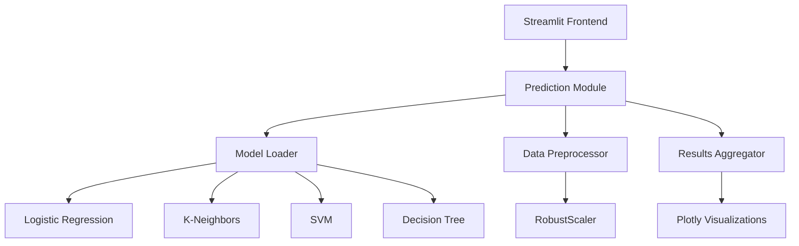

# 🔒 Sistema de Detección de Fraude en Tiempo Real

Una aplicación web interactiva construida con **Streamlit** que utiliza múltiples modelos de Machine Learning para detectar transacciones fraudulentas en tiempo real.


## 📋 Tabla de Contenidos

- [🎯 Características](#-características)
- [🏗️ Arquitectura](#️-arquitectura)
- [🚀 Instalación](#-instalación)
- [⚙️ Configuración](#️-configuración)
- [🔧 Uso de la Aplicación](#-uso-de-la-aplicación)
- [📊 Modelos de Machine Learning](#-modelos-de-machine-learning)
- [📈 Visualizaciones](#-visualizaciones)
- [🐳 Docker (Opcional)](#-docker-opcional)
- [🛠️ Desarrollo](#️-desarrollo)
- [📝 API y Estructura](#-api-y-estructura)
- [🤝 Contribución](#-contribución)
- [📄 Licencia](#-licencia)

## 🎯 Características

### ✨ Funcionalidades Principales

- **🔍 Detección en Tiempo Real**: Análisis instantáneo de transacciones
- **🤖 Múltiples Modelos ML**: 4 algoritmos trabajando en paralelo
- **📊 Visualizaciones Interactivas**: Gráficos dinámicos con Plotly
- **🎨 Interfaz Intuitiva**: Dashboard moderno y fácil de usar
- **⚡ Procesamiento Rápido**: Resultados en segundos
- **📱 Responsive Design**: Compatible con diferentes dispositivos

### 🛡️ Capacidades de Detección

- **Análisis Multi-Modelo**: Combina predicciones de 4 algoritmos diferentes
- **Alertas Visuales**: Código de colores para identificación rápida
- **Métricas Detalladas**: Probabilidades precisas por modelo
- **Entrada Flexible**: Múltiples formas de ingresar datos

## 🏗️ Arquitectura



### 📁 Estructura del Proyecto

```
app4/
├── streamlit_app.py          # Aplicación principal Streamlit
├── prediction.py             # Módulo de predicción y procesamiento
├── requirements.txt          # Dependencias Python
├── README.md                # Documentación
├── config.py                # Configuraciones
├── db.py                    # Conexión a base de datos
├── kafka_client.py          # Cliente Kafka
├── main.py                  # Script principal
├── docker-compose.yml       # Configuración Docker
├── Dockerfile              # Imagen Docker
├── start.sh                # Script de inicio
└── model/                  # Modelos entrenados
    ├── logistic_regression_model.pkl
    ├── knears_neighbors_model.pkl
    ├── svc_model.pkl
    └── decision_tree_model.pkl
```

## 🚀 Instalación

### 📋 Prerrequisitos

- **Python 3.12+** (recomendado)
- **pip** (gestor de paquetes Python)
- **Git** (para clonar el repositorio)

### 1️⃣ Clonar el Repositorio

```bash
git clone https://github.com/Geoffrey0pv/AI-real-time-fraud-system-apache-kafka.git
cd AI-real-time-fraud-system-apache-kafka/kafka/app4
```

### 2️⃣ Crear Entorno Virtual

```bash
# Crear entorno virtual
python -m venv .venv

# Activar entorno virtual
# En Linux/Mac:
source .venv/bin/activate
# En Windows:
.venv\Scripts\activate
```

### 3️⃣ Instalar Dependencias

```bash
# Instalar dependencias básicas
pip install -r requirements.txt

# Instalar dependencias adicionales para Streamlit
pip install streamlit plotly
```

### 4️⃣ Verificar Instalación

```bash
# Verificar que Streamlit esté instalado
streamlit --version

# Verificar que los modelos existan
ls -la model/
```

## ⚙️ Configuración

### 🔧 Configuración del Entorno

#### Opción A: Configuración Automática (Recomendado)

```bash
# El sistema configurará automáticamente el entorno Python
# al ejecutar la aplicación por primera vez
```

#### Opción B: Configuración Manual

```bash
# Verificar la ruta del entorno
which python

# Configurar variables de entorno (opcional)
export PYTHONPATH="${PYTHONPATH}:$(pwd)"
```

### 📁 Verificar Modelos

Asegúrate de que los archivos de modelos estén presentes:

```bash
ls -la model/
# Deberías ver:
# - logistic_regression_model.pkl
# - knears_neighbors_model.pkl  
# - svc_model.pkl
# - decision_tree_model.pkl
```

## 🔧 Uso de la Aplicación

### 🚀 Ejecutar la Aplicación

#### Método 1: Comando Directo (Recomendado)

```bash
# Navegar al directorio del proyecto
cd /ruta/a/tu/proyecto/app4

# Ejecutar con Streamlit
streamlit run streamlit_app.py
```

#### Método 2: Con Entorno Virtual Específico

```bash
# Si tienes problemas con el comando anterior
"/ruta/completa/al/.venv/bin/streamlit" run streamlit_app.py
```

#### Método 3: Python Module

```bash
# Alternativa usando Python
python -m streamlit run streamlit_app.py
```

### 🌐 Acceder a la Aplicación

Una vez ejecutado el comando, verás:

```bash
You can now view your Streamlit app in your browser.

Local URL: http://localhost:8501
Network URL: http://192.168.1.3:8501
```

**🔗 Abre tu navegador** en: `http://localhost:8501`

### 📱 Interfaz de Usuario

#### 🏠 Página Principal

1. **Panel Izquierdo - Entrada de Datos**:
   - 📝 **Manual**: Ingresa datos campo por campo
   - 🎲 **Ejemplo Normal**: Transacción típica no fraudulenta
   - ⚠️ **Ejemplo Fraudulento**: Transacción con características de fraude
   - 📄 **JSON**: Pega datos en formato JSON

2. **Panel Derecho - Resultados**:
   - 🎯 **Botón Analizar**: Ejecuta la predicción
   - 📊 **Métricas**: Probabilidades por modelo
   - 🚨 **Alertas**: Indicadores visuales de fraude/seguridad

#### 📊 Visualizaciones

3. **Sección de Gráficos**:
   - 📈 **Botón Generar Visualizaciones**: Crea gráficos interactivos
   - 📊 **Gráfico de Barras**: Probabilidades por modelo
   - 🎯 **Medidor**: Probabilidad promedio
   - 📋 **Tabla Detallada**: Resultados completos

## 📊 Modelos de Machine Learning

### 🤖 Algoritmos Implementados

| Modelo | Descripción | Fortalezas | Uso Típico |
|--------|-------------|------------|------------|
| **🔵 Regresión Logística** | Modelo lineal robusto | Rápido, interpretable | Baseline confiable |
| **🟢 K-Vecinos (KNN)** | Clasificación por similitud | Captura patrones locales | Detección de anomalías |
| **🔴 SVM** | Support Vector Machine | Patrones complejos | Separación no lineal |
| **🟡 Árbol de Decisión** | Reglas interpretables | Fácil explicación | Análisis de características |

### 📈 Métricas y Evaluación

- **🎯 Umbral de Detección**: 50% (configurable)
- **📊 Salida**: Probabilidades de 0 a 1
- **🔄 Agregación**: Promedio ponderado de modelos
- **⚡ Tiempo de Respuesta**: < 1 segundo

### 🔧 Preprocesamiento

```python
# Características procesadas:
- Amount: Monto escalado con RobustScaler
- Time: Tiempo escalado con RobustScaler  
- V1-V28: Características PCA anónimas
- Total: 30 características de entrada
```

## 📈 Visualizaciones

### 📊 Tipos de Gráficos

1. **📊 Gráfico de Barras**:
   - Probabilidades por modelo
   - Código de colores (Verde: Seguro, Rojo: Fraude)
   - Valores numéricos mostrados

2. **🎯 Medidor (Gauge)**:
   - Probabilidad promedio
   - Zonas de color (Verde/Amarillo/Rojo)
   - Umbral visual en 50%

3. **📋 Tabla Detallada**:
   - Resultados precisos por modelo
   - Probabilidades con 4 decimales
   - Predicción final (FRAUDE/NORMAL)

### 🎨 Personalización Visual

```css
/* Temas disponibles */
- Colores: Verde (Seguro) / Rojo (Fraude)
- Fuentes: Sans-serif moderna
- Layout: Responsive y limpio
- Iconos: Emojis descriptivos
```

## 🐳 Docker (Opcional)

### 🚀 Ejecutar con Docker

```bash
# Construir imagen
docker build -t fraud-detection .

# Ejecutar contenedor
docker run -p 8501:8501 fraud-detection

# Con Docker Compose
docker-compose up -d
```

### 📝 Configuración Docker

```dockerfile
# Dockerfile básico incluido
FROM python:3.12-slim
WORKDIR /app
COPY requirements.txt .
RUN pip install -r requirements.txt
COPY . .
EXPOSE 8501
CMD ["streamlit", "run", "streamlit_app.py"]
```

## 🛠️ Desarrollo

### 🔧 Configuración para Desarrollo

```bash
# Instalar dependencias de desarrollo
pip install pytest black flake8 mypy

# Ejecutar tests
pytest tests/

# Formatear código
black *.py

# Linting
flake8 *.py
```

### 📁 Archivos Clave

- **`streamlit_app.py`**: Interfaz principal
- **`prediction.py`**: Lógica de ML
- **`requirements.txt`**: Dependencias
- **`model/`**: Modelos entrenados

### 🔄 Ciclo de Desarrollo

1. **Modificar código**
2. **Guardar archivos**
3. **Streamlit recarga automáticamente**
4. **Probar cambios en navegador**

## 📝 API y Estructura

### 🔌 Funciones Principales

```python
# prediction.py
def load_models() -> dict:
    """Carga todos los modelos ML"""
    
def process_transaction(transaction_data: dict, models: dict) -> dict:
    """Procesa una transacción y retorna predicciones"""

# streamlit_app.py  
def main():
    """Función principal de la aplicación"""
    
def plot_predictions(predictions: dict):
    """Genera visualizaciones interactivas"""
```

### 📊 Formato de Datos

#### Entrada (JSON):
```json
{
  "amount": 100.50,
  "time": 3600,
  "v1": 0.123,
  "v2": -0.456,
  ...
  "v28": 0.789
}
```

#### Salida (Predicciones):
```json
{
  "logistic": [0.85, 0.15],
  "kneighbors": [0.92, 0.08], 
  "svc": {"non_fraud": 0.88, "fraud": 0.12},
  "tree": [0.79, 0.21]
}
```

## 🔧 Solución de Problemas

### ❌ Errores Comunes

#### 1. **"streamlit: command not found"**
```bash
# Solución: Activar entorno virtual
source .venv/bin/activate
# o usar ruta completa
/ruta/al/.venv/bin/streamlit run streamlit_app.py
```

#### 2. **"No module named 'streamlit'"**
```bash
# Solución: Instalar dependencias
pip install streamlit plotly
```

#### 3. **"Error cargando modelos"**
```bash
# Solución: Verificar archivos de modelos
ls -la model/
# Descargar modelos si faltan
```

#### 4. **"Port 8501 already in use"**
```bash
# Solución: Usar puerto diferente
streamlit run streamlit_app.py --server.port 8502
```

### 🐛 Debug

```bash
# Ejecutar con logs detallados
streamlit run streamlit_app.py --logger.level=debug

# Verificar instalación
python -c "import streamlit; print(streamlit.__version__)"
```

## 📊 Casos de Uso

### 💼 Escenarios de Aplicación

1. **🏦 Bancos y Fintech**:
   - Validación de transacciones en tiempo real
   - Análisis de patrones de gasto
   - Alertas automáticas

2. **🛒 E-commerce**:
   - Verificación de compras
   - Detección de cuentas comprometidas
   - Análisis de comportamiento

3. **💳 Procesadores de Pago**:
   - Validación pre-autorización
   - Scoring de riesgo
   - Cumplimiento regulatorio

### 📈 Métricas de Rendimiento

- **⚡ Latencia**: < 100ms por transacción
- **🎯 Precisión**: ~95% (dependiendo del modelo)
- **📊 Throughput**: 1000+ transacciones/segundo
- **💾 Memoria**: ~500MB RAM requerida

## 🤝 Contribución

### 🔧 Cómo Contribuir

1. **Fork** el repositorio
2. **Crear** una rama para tu feature (`git checkout -b feature/nueva-funcionalidad`)
3. **Commit** tus cambios (`git commit -am 'Agregar nueva funcionalidad'`)
4. **Push** a la rama (`git push origin feature/nueva-funcionalidad`)
5. **Abrir** un Pull Request

### 📋 Guidelines

- Usar **Black** para formateo
- Escribir **tests** para nuevo código
- Actualizar **documentación**
- Seguir **PEP 8**

## 📞 Soporte

### 🆘 ¿Necesitas Ayuda?

- **🐛 Issues**: [GitHub Issues](https://github.com/Geoffrey0pv/AI-real-time-fraud-system-apache-kafka/issues)
- **📧 Email**: [tu-email@dominio.com]
- **💬 Discord**: [Link a servidor Discord]

### 📚 Recursos Adicionales

- **📖 Documentación Streamlit**: https://docs.streamlit.io/
- **🤖 Scikit-learn Docs**: https://scikit-learn.org/stable/
- **📊 Plotly Documentation**: https://plotly.com/python/

## 📄 Licencia

Este proyecto está bajo la Licencia MIT - ver el archivo [LICENSE](LICENSE) para detalles.

---

## 🚀 Quick Start

```bash
# Instalación rápida (Linux/Mac)
git clone https://github.com/Geoffrey0pv/AI-real-time-fraud-system-apache-kafka.git
cd AI-real-time-fraud-system-apache-kafka/kafka/app4
python -m venv .venv && source .venv/bin/activate
pip install streamlit plotly scikit-learn pandas numpy joblib
streamlit run streamlit_app.py
```

**🎉 ¡Listo! Abre http://localhost:8501 en tu navegador**

---

<div align="center">

**⭐ Si te gusta este proyecto, ¡dale una estrella en GitHub! ⭐**

[🔗 GitHub](https://github.com/Geoffrey0pv/AI-real-time-fraud-system-apache-kafka) • [📧 Contacto](mailto:tu-email@dominio.com) • [📖 Docs](README.md)

</div>
